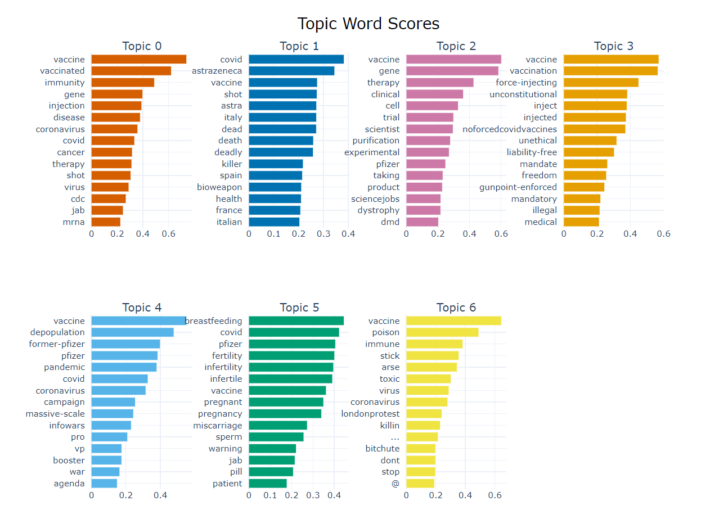

### Topic Modeling using Transformers (BERTopic)

This project contains sample code in Python to: 
* **Hydrate (i.e., extract) tweets** of interest using available tweet IDs. The tweet ID list used for this code was shared by [Hayawi et al. (2021)](https://github.com/sakibsh/ANTiVax/blob/main/Labeled/ids.txt) and includes COVID-19 vaccine misinformation labels.
* **Perform topic modeling** using [BERTopic approach](https://maartengr.github.io/BERTopic/index.html) that leverages transformers and c-TF-IDF to create dense clusters allowing for easily interpretable topics whilst keeping important words in the topic descriptions
* Below you can see **the most salient terms** for each topic identified in Hayawi et al. (2021). Note that this is examplar code; thus, additional cleaning steps to clean salient tokens may be needed.

